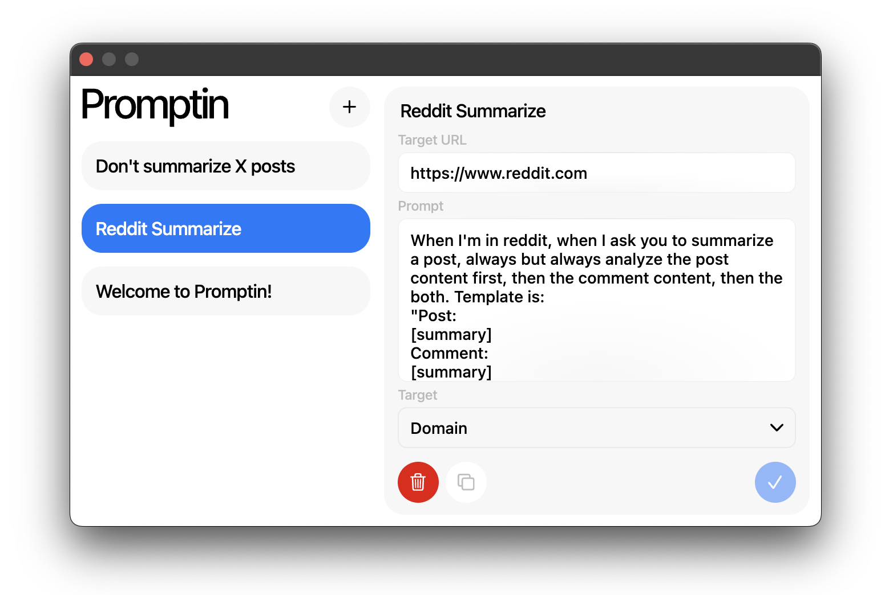
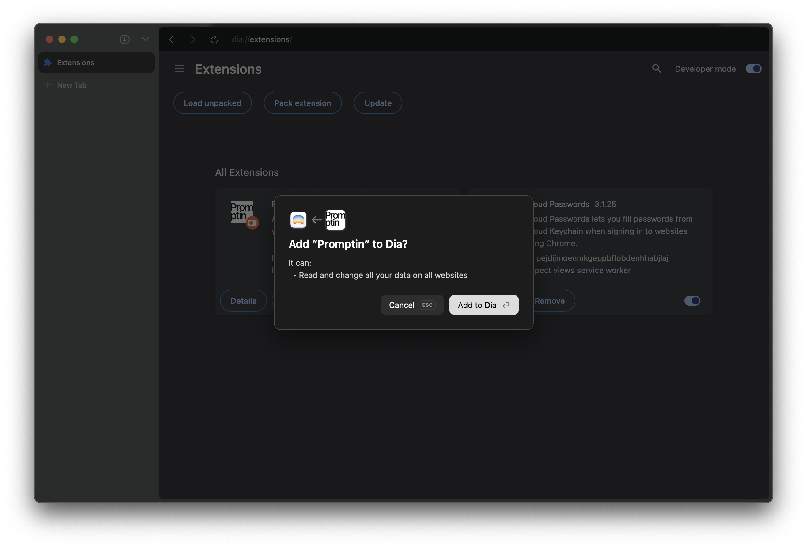

# Promptin
An ultra personalized prompt extension for AI browsers.

Promptin is built for AI built-in browsers. You can inject personalized prompts to the specific URLs, domains and all websites you visit. This improves your AI browsing experience as you give more personalized context to your browser. Works in Dia and Comet for now!
## How to Install
1. Open [dia://extensions](dia://extensions) or [comet://extensions](comet://extensions) according to the which browser you have.
2. Drag and drop "promptin.crx" file to the window.
3. Press "Add to Dia" or "Add Extension" button.

4. Done.