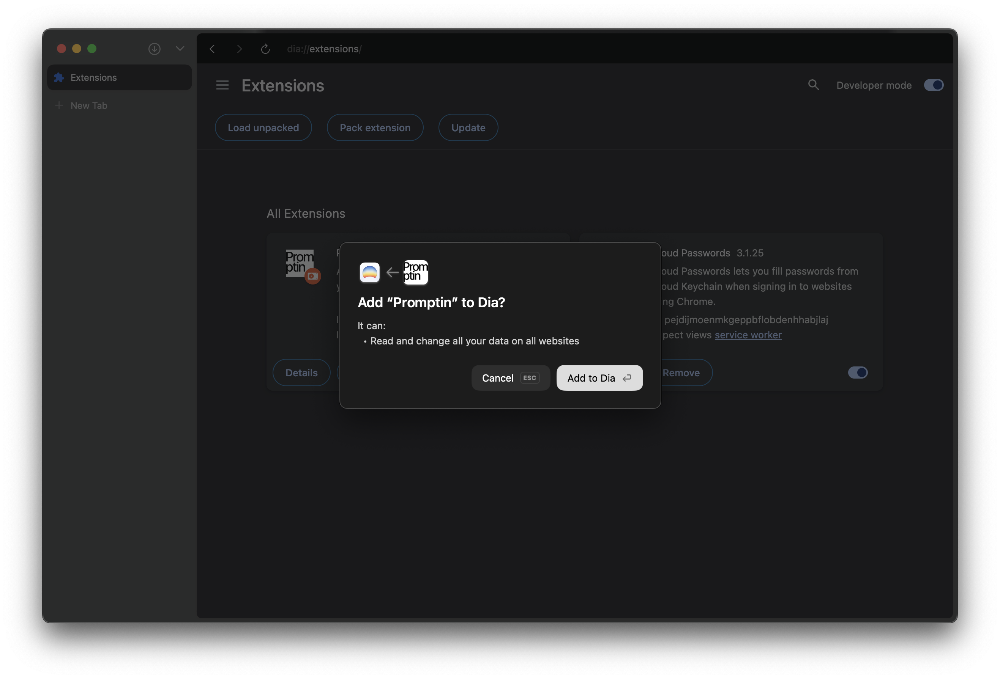

# Promptin
An ultra personalized prompt extension for AI browsers.

Promptin is built for AI built-in browsers. You can inject personalized prompts to specific URLs, domains, and all websites you visit. This improves your AI browsing experience as you give more personalized context to your browser. Works in Dia and Comet for now!
## How to Install
1. Open [dia://extensions](dia://extensions) or [comet://extensions](comet://extensions) according to which browser you have.
2. Enable "Developer Mode" from the switch at the top right, if it isn't enabled.
3. Drag and drop the "promptin.crx" file to the window.
4. Press "Add to Dia" or "Add Extension" button.

5. Done.